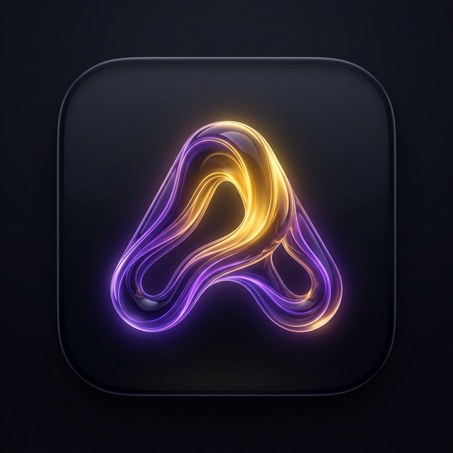

<div align="center">
  

  # Aura Studio — Frontend

  **Visual AI Orchestration Platform**

  No-code LLM workflows · RAG pipelines · Production AI automation

  [](https://react.dev)
  [](https://www.typescriptlang.org)
  [](https://reactflow.dev)
  [](https://vitejs.dev)
  [](https://pnpm.io)

  [Live App](https://aurastudio.ai) · [Portfolio](https://devamit.co.in/) · [LinkedIn](https://www.linkedin.com/in/devamitch/) · [Buy Me a Coffee](https://buymeacoffee.com/amithellmab)
</div>

---

## Table of Contents

- [Overview](#overview)
- [Tech Stack](#tech-stack)
- [Project Structure](#project-structure)
- [Getting Started](#getting-started)
- [Environment Variables](#environment-variables)
- [Architecture](#architecture)
- [Pages & Routes](#pages--routes)
- [Core Components](#core-components)
- [Node System](#node-system)
- [Services](#services)
- [State Management](#state-management)
- [Auth System](#auth-system)
- [AI Chat & Gemini](#ai-chat--gemini)
- [Credential Security](#credential-security)
- [CSS Conventions](#css-conventions)
- [Keyboard Shortcuts](#keyboard-shortcuts)
- [Export System](#export-system)
- [PWA & SEO](#pwa--seo)
- [Building for Production](#building-for-production)
- [Support the Developer](#support-the-developer)

---

## Overview

Aura Studio is a **visual AI workflow builder** that lets you:

- **Drag and drop** 45+ node types to design LLM pipelines, RAG workflows, and automation chains
- **AI-generate** entire workflows from a natural language prompt via the Intent Orchestrator (Gemini 2.5 Flash)
- **Simulate** workflow execution with a frontend engine — see per-step logs, tokens, and costs
- **Export** to production-ready code: Telegram Bot, Discord Bot, WhatsApp Bot, React SPA, Node.js API, Fullstack Docker, WordPress Plugin
- **Secure** all credentials client-side with AES-256-GCM — keys never leave your browser

---

## Tech Stack

| Layer | Technology |
|---|---|
| Framework | React 18 |
| Language | TypeScript 5 |
| Canvas | ReactFlow v11 |
| State | Zustand |
| Animations | Framer Motion |
| Build tool | Vite 5 |
| Package manager | **pnpm** (never use npm/yarn) |
| Auth | Google OAuth (`@react-oauth/google`) |
| AI | Gemini 2.5 Flash REST API (streaming SSE) |
| Payments | Stripe (placeholder — CheckoutModal) |
| Icons | Lucide React |
| Auto-layout | Dagre |
| Zip export | JSZip |
| PWA | vite-plugin-pwa |
| Fonts | Syne (display), Figtree (body), JetBrains Mono (code) |

---

## Project Structure

```
frontend/
├── public/
│   ├── app-icon.png          # App icon (32x32, borderRadius 8)
│   ├── favicon.svg           # Star icon on #6366f1 background
│   ├── manifest.webmanifest  # PWA manifest (shortcuts, share_target)
│   └── icons/                # PWA icon set
├── src/
│   ├── App.tsx               # Root — GoogleOAuthProvider + BrowserRouter + all routes
│   ├── main.tsx              # Entry — calls bootstrapAuth() then renders App
│   ├── store.ts              # Unified Zustand store (auth + canvas state)
│   ├── types.ts              # Shared TypeScript types
│   ├── index.css             # All global styles + component CSS
│   ├── chat.css              # AI chat component styles
│   ├── assets/               # Static image imports (app-icon, auth-banner)
│   ├── components/
│   │   ├── auth/
│   │   │   └── AuthGate.tsx          # Google Sign-In screen (native OAuth button)
│   │   ├── canvas/
│   │   │   ├── PipelineUI.tsx        # ReactFlow canvas (MiniMap, Controls, Background)
│   │   │   └── CustomEdge.tsx        # Smoothstep edge with delete button
│   │   ├── landing/
│   │   │   ├── LandingPage.tsx       # Marketing landing page (full, gamified)
│   │   │   ├── PrivacyPage.tsx       # Privacy policy
│   │   │   └── TermsPage.tsx         # Terms of service
│   │   ├── layout/
│   │   │   ├── Header.tsx            # Top nav bar (brand, actions, user dropdown)
│   │   │   └── RightChatPanel.tsx    # Collapsible right panel (AI Chat / Node Config tabs)
│   │   ├── modals/
│   │   │   ├── IntentOrchestrator.tsx  # AI prompt to workflow (5-phase, framer-motion)
│   │   │   ├── ExecutionPanel.tsx      # Simulation runner + logs + stats
│   │   │   ├── ExportModal.tsx         # 3-step export to JSZip download
│   │   │   └── VersionHistory.tsx      # Local snapshots (create/restore/delete)
│   │   ├── node/
│   │   │   ├── BaseNode.tsx            # Legacy node wrapper
│   │   │   ├── AddHandleForm.tsx       # Dynamic handle management
│   │   │   └── NodeSidebar.tsx         # Per-node config + BYOK credentials + validation
│   │   ├── settings/
│   │   │   └── SettingsPage.tsx        # User settings
│   │   ├── sidebar/
│   │   │   ├── Toolbar.tsx             # Left node palette (search, groups, drag-to-canvas)
│   │   │   ├── AIPromptChat.tsx        # Gemini chat (streaming SSE, voice input)
│   │   │   └── WorkflowsModal.tsx      # Saved workflows list
│   │   └── ui/
│   │       ├── AlertModal.tsx
│   │       ├── CheckoutModal.tsx       # Payment method picker (Stripe/Razorpay/PayU/PayPal)
│   │       ├── IntegratedBottomBar.tsx # Canvas bottom toolbar
│   │       ├── KeyboardHelp.tsx        # Keyboard shortcuts modal
│   │       ├── Toaster.tsx             # Toast notification system
│   │       └── UpgradeModal.tsx        # Upgrade to Pro prompt
│   ├── hooks/
│   │   └── useAuthMeSync.ts            # Syncs auth with backend /me endpoint
│   ├── lib/
│   │   ├── google-auth.ts              # OAuth helpers, JWT decode, localStorage token
│   │   └── supabase.ts                 # Supabase client (unused for auth, available for DB)
│   ├── nodes/
│   │   ├── registry.ts                 # nodeTypes map + NODE_META palette entries
│   │   ├── definitions.ts              # 45+ NodeDefinition registry
│   │   ├── GenericNode.tsx             # Universal node renderer (driven by NodeDefinition)
│   │   └── [legacy node files]         # Older dedicated node components
│   └── services/
│       ├── credentialEngine.ts         # AES-256-GCM Web Crypto encryption
│       ├── graphCompiler.ts            # Dagre auto-layout + topological sort
│       ├── executionSimulator.ts       # Frontend simulation engine (seeded RNG)
│       ├── promptToCanvas.ts           # Gemini AI to workflow JSON to canvas
│       ├── masterPromptGenerator.ts    # Workflow to markdown system prompt
│       └── zipExporter.ts              # JSZip project scaffolder (7 types)
```

---

## Getting Started

### Prerequisites

- Node.js >= 18
- pnpm >= 8 (`npm install -g pnpm`)
- A Google OAuth client ID (optional — app runs in demo mode without it)
- A Gemini API key (optional — AI features disabled without it)

### Installation

```bash
cd frontend
pnpm install
```

### Development

```bash
pnpm dev
# => http://localhost:5173
```

### Build

```bash
pnpm build
# Output: frontend/dist/
```

### Preview build

```bash
pnpm preview
```

---

## Environment Variables

Create a `.env.local` file in the `frontend/` directory:

```env
# Google OAuth (required for login — app runs in demo mode without this)
VITE_GOOGLE_CLIENT_ID=your_google_client_id

# Gemini API key (required for AI Chat + Intent Orchestrator)
VITE_GEMINI_KEY=your_gemini_api_key

# Backend API URL
VITE_API_URL=http://localhost:8000

# Stripe (optional — payment placeholder)
VITE_STRIPE_PUBLISHABLE_KEY=pk_test_placeholder

# Payment links (optional — for CheckoutModal deep links)
VITE_STRIPE_LINK_PRO=
VITE_STRIPE_LINK_ANNUAL=
VITE_RAZORPAY_LINK_PRO=
VITE_RAZORPAY_LINK_ANNUAL=
VITE_STRIPE_LINK_CREDITS_100=
VITE_STRIPE_LINK_CREDITS_500=
VITE_STRIPE_LINK_CREDITS_2000=
```

---

## Architecture

### Data flow

```
User Action
    |
    v
React Component  <--->  Zustand Store
    |                        |
    v                        v
ReactFlow Canvas      Services Layer
                      |-- credentialEngine (AES-256-GCM)
                      |-- graphCompiler (dagre)
                      |-- executionSimulator
                      |-- promptToCanvas (Gemini)
                      |-- zipExporter (JSZip)
```

### State shape (Zustand store)

```typescript
// Auth
user: AuthUser | null
loading: boolean
theme: "dark" | "light"
plan: UserPlan  // "free" | "pro" | "annual"

// Canvas
nodes: Node[]
edges: Edge[]
selectedNodeId: string | null
rightPanelMode: "chat" | "node-config"

// UI flags
showIntentOrchestrator: boolean
showExecutionPanel: boolean
showExportModal: boolean
showVersionHistory: boolean

// Versions
versions: WorkflowVersion[]
```

---

## Pages & Routes

| Route | Component | Auth required |
|---|---|---|
| `/` | `LandingPage` | No |
| `/login` | `AuthGate` | No |
| `/app` | `PipelineUI` | Yes |
| `/settings` | `SettingsPage` | Yes |
| `/privacy` | `PrivacyPage` | No |
| `/terms` | `TermsPage` | No |
| `*` | Redirect to `/` | — |

---

## Core Components

### `PipelineUI.tsx`
Main ReactFlow canvas. Features:
- Drag-and-drop from left palette
- Ctrl+C / Ctrl+V / Ctrl+D copy/paste/duplicate
- Delete / Backspace to remove selected nodes/edges
- MiniMap, Controls, Background (dots pattern)
- `minZoom: 0.15`, `maxZoom: 2.5`, `panOnScroll: true`

### `Header.tsx`
Top navigation. Contains:
- Workflow name (editable inline)
- Actions: Save, Load, Version History, Layout, Run, Export
- Build with AI button (opens IntentOrchestrator)
- Credits bar (free plan) / Plan pill (pro/annual)
- User dropdown (name, avatar, sign out)
- Theme toggle

### `IntentOrchestrator.tsx`
5-phase AI workflow generator:
1. **Describe** — user types natural language prompt
2. **Planning** — Gemini analyzes and plans nodes
3. **Generating** — workflow JSON created
4. **Preview** — confirm before applying
5. **Applying** — nodes/edges placed on canvas

### `ExecutionPanel.tsx`
Frontend workflow simulation:
- Topological sort via `graphCompiler`
- Per-node execution with seeded RNG
- State badges: `running | success | failed | skipped`
- Per-step logs and token/cost statistics

---

## Node System

### Node groups

| Group | Color | Example nodes |
|---|---|---|
| Triggers | `#f59e0b` amber | Webhook, Schedule, Manual Input, Telegram Trigger |
| AI & Core | `#6366f1` indigo | LLM, Prompt Template, Chain, Agent, Embedder |
| Logic & Flow | `#7c3aed` violet | Condition, Switch, Loop, Code, Merge |
| Data & Transform | `#3b82f6` blue | Text, HTTP Request, JSON Parser, Transformer |
| Integrations | `#10b981` emerald | Email, Slack, Notion, GitHub, Google Sheets |
| RAG & Memory | `#06b6d4` cyan | Vector Store, Retriever, Memory, Chunker |

### Adding a new node

1. Add a `NodeDefinition` entry in `src/nodes/definitions.ts`
2. Register it in `src/nodes/registry.ts` (both `NODE_META` and `nodeTypes`)
3. `GenericNode.tsx` handles rendering automatically via the definition

### Handle format

All handle IDs follow: `${nodeId}-${handleId}`

---

## Services

### `credentialEngine.ts`
- **Algorithm:** AES-256-GCM via Web Crypto API
- **Key derivation:** PBKDF2 with device-specific salt
- **Storage:** Browser localStorage only — never transmitted to any server

### `graphCompiler.ts`
- Uses `dagre` for automatic node layout
- Topological sort for execution ordering
- `compileGraph()` returns ordered nodes with edge connections

### `executionSimulator.ts`
- Seeded RNG for reproducible simulations
- Simulates latency, token usage, costs per node
- Emits per-node status: `running -> success | failed | skipped`

### `promptToCanvas.ts`
- Sends user prompt + system prompt (45+ node definitions) to Gemini
- Parses response JSON to canvas nodes + edges
- Calls `store.applyGeneratedGraph()` to place on canvas

### `zipExporter.ts`
- 7 project type scaffolders
- Generates `package.json`, main files, `.env.example`, `Dockerfile`
- Downloads as `project-name.zip`

---

## State Management

```typescript
import { useStore } from "./store"

// Reading state
const user = useStore((s) => s.user)
const nodes = useStore((s) => s.nodes)

// Actions
const { addNode, setSelectedNode } = useStore()

// Multiple values (use shallow to prevent extra re-renders)
import { shallow } from "zustand/shallow"
const { theme, undo, redo } = useStore(
  (s) => ({ theme: s.theme, undo: s.undo, redo: s.redo }),
  shallow
)
```

---

## Auth System

**Flow:**
1. `main.tsx` calls `bootstrapAuth()` — reads localStorage token, decodes JWT
2. `AuthGate` shows Google Sign-In if `store.user === null`
3. `signInWithGoogle(credential)` saves token, decodes payload, calls `refreshUser`
4. `signOut()` clears localStorage, resets store

**Demo mode:** If `VITE_GOOGLE_CLIENT_ID` is not configured, `AuthGate` passes through automatically.

---

## AI Chat & Gemini

**File:** `src/components/sidebar/AIPromptChat.tsx`

- **Model:** Gemini 2.5 Flash (streaming SSE) with 1.5 Flash fallback
- **API:** Direct REST to `generativelanguage.googleapis.com`
- **Key:** `VITE_GEMINI_KEY` env var (client-side, non-sensitive)
- **Features:** Streaming cursor animation, voice input, task plan detection, credit gating

**Workflow generation:** Detects AI pipeline intent, calls `generateWorkflowFromPrompt()`, shows confirm button before applying to canvas.

---

## Credential Security

Every credential entered in the Node Config panel is:

1. Encrypted with AES-256-GCM via Web Crypto API
2. Key derived via PBKDF2 with a device-specific salt
3. Stored in `localStorage` under a node-specific key
4. Never transmitted to Aura Studio servers
5. Excluded from exports by default

This is an architectural guarantee, not a policy promise.

---

## CSS Conventions

All styles live in `src/index.css` and `src/chat.css`. Use CSS custom properties.

**Key tokens:**
```css
--primary: #6366f1        /* indigo */
--bg-app: #070709
--bg-panel: #0f0f14
--bg-input: #1a1a24
--text-900: #eeeef5       /* primary text */
--text-500: #686880       /* muted text */
--font-display: "Syne"
--font-body: "Figtree"
--font-mono: "JetBrains Mono"
```

**Rules:**
- Append new CSS at the bottom of `index.css` — never modify existing classes above line 8000
- Never use inline `<style>` tags — use the global CSS file or inline `style` props
- Landing pages use `height: 100dvh; overflow-y: auto` since `html, body, #root` have `overflow: hidden`

---

## Keyboard Shortcuts

| Shortcut | Action |
|---|---|
| `Ctrl/Cmd + Z` | Undo |
| `Ctrl/Cmd + Y` or `Ctrl/Cmd + Shift + Z` | Redo |
| `Ctrl/Cmd + \` | Toggle right panel |
| `Ctrl/Cmd + L` | Auto-layout |
| `Ctrl/Cmd + 1` | Switch to AI Chat tab |
| `Ctrl/Cmd + 2` | Switch to Node Config tab |
| `Ctrl/Cmd + C` | Copy selected nodes |
| `Ctrl/Cmd + V` | Paste nodes |
| `Ctrl/Cmd + D` | Duplicate selected |
| `Delete` or `Backspace` | Delete selected |
| `?` | Toggle keyboard help |
| `Escape` | Deselect + close panels |

---

## Export System

7 project scaffolds available:

| Type | Stack | Use case |
|---|---|---|
| Telegram Bot | `node-telegram-bot-api` + Express | Bot automation |
| Discord Bot | `discord.js` + Express | Community bots |
| WhatsApp Bot | Twilio + Express | Business messaging |
| React SPA | Vite + React | Web frontends |
| Node.js API | Express REST | Backend APIs |
| Fullstack Docker | React + Node + docker-compose | Full deployments |
| WordPress Plugin | PHP plugin scaffold | WP integrations |

---

## PWA & SEO

- **Service worker:** `vite-plugin-pwa` with Workbox, `registerType: "autoUpdate"`
- **Manifest:** `public/manifest.webmanifest` — shortcuts, share_target
- **Meta tags:** Full OG/Twitter/JSON-LD/canonical in `index.html`
- **Fonts:** Loaded via `<link>` in `index.html` (not `@import`) for performance

---

## Building for Production

```bash
pnpm build
# Output: frontend/dist/

pnpm preview  # local preview
```

Deploy `dist/` to Netlify, Vercel, Cloudflare Pages, or any static host.

For SPA routing, add a `_redirects` file:
```
/* /index.html 200
```

---

## Support the Developer

Aura Studio is built solo, nights and weekends, as a passion project.

If you find it useful, consider supporting:

- [Buy Me a Coffee](https://buymeacoffee.com/amithellmab) — keeps the servers running
- [Connect on LinkedIn](https://www.linkedin.com/in/devamitch/) — let's build together
- [Portfolio](https://devamit.co.in/) — see other projects
- [Email](mailto:hello@devamit.co.in) — feedback, partnerships, collaborations

---

*Built with care by [Amit Chakraborty](https://devamit.co.in/)*
